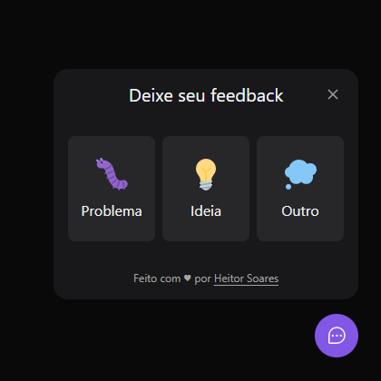

# nwlReturn-FrontEnd-ReactJs

<h1 align="center">
    
    
</h1>

<br>

## 🧪 Technologies

This project was developed using the following technologies:
 
- [React Native](https://reactnative.dev/)
- [Npm](https://www.npmjs.com/)
- [TailwindCSS](https://tailwindcss.com/)
- [Prisma](https://www.prisma.io/)


## 🚀 Getting started

Clone the project and access the folder.

```bash
$ git clone https://github.com/heitorsoares12/nwlReturn-FrontEnd-ReactJs.git
```

Follow the steps below:
```bash
# Install the dependencies
$ npm install

# Start the project
$ npm run dev
```

## 🔖 Layout

You can view the project layout through the links below:

- [Layout](https://www.figma.com/file/WO4dr4R7lbsKDvgTDnOhpY/Feedback-Widget-(Community)) 

Remembering that you need to have a [Figma](http://figma.com/) account to access it.

## 📝 License

This project is licensed under the MIT License. See the [LICENSE](LICENSE.md) file for details.

---

Made with 💜 by [HeitorSoares](https://www.linkedin.com/in/heitor-alexandre-soares-444b97191/) 👋
